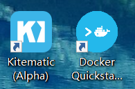
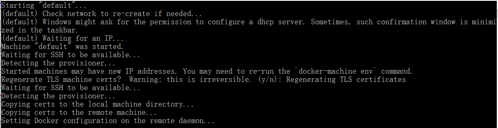
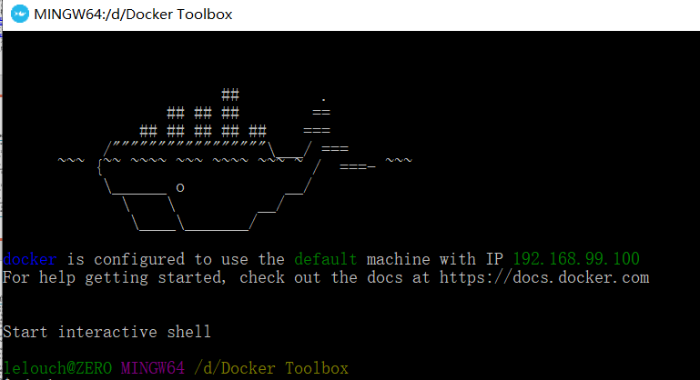
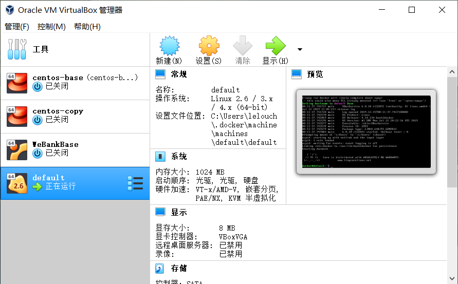
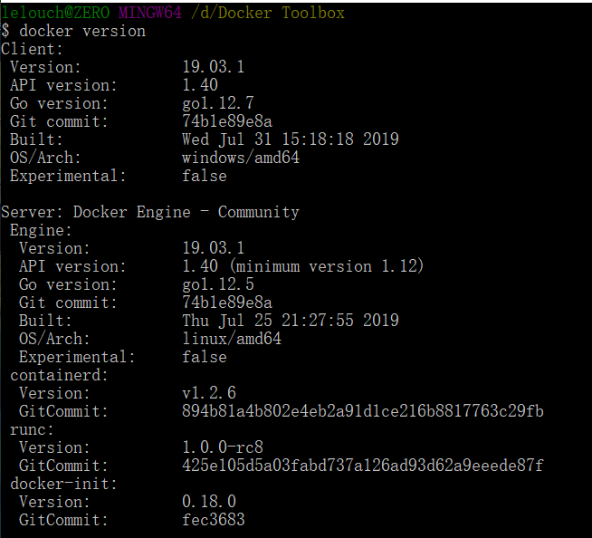
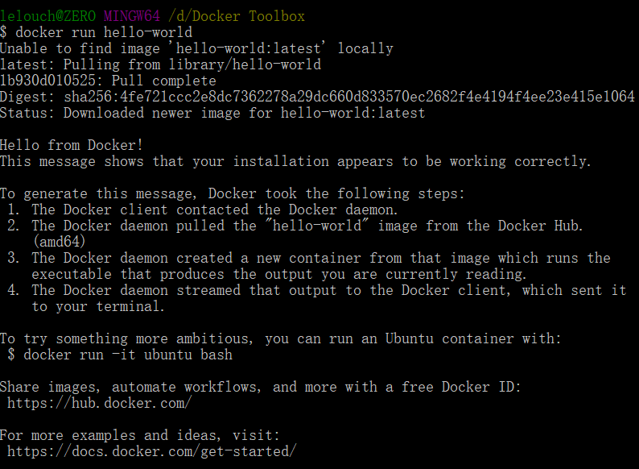
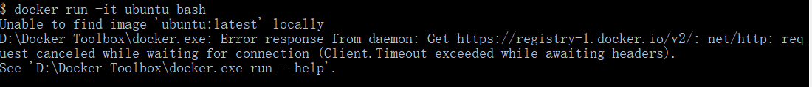
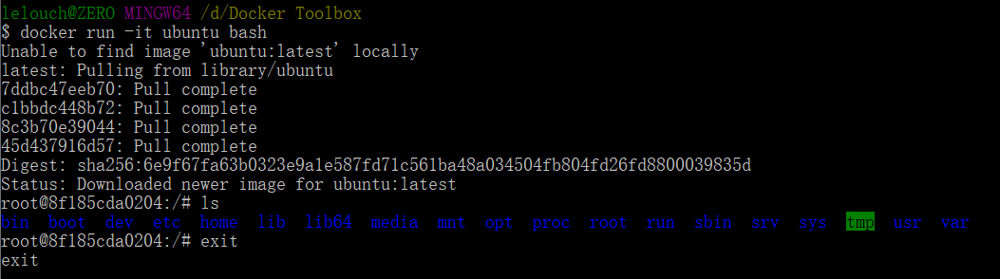
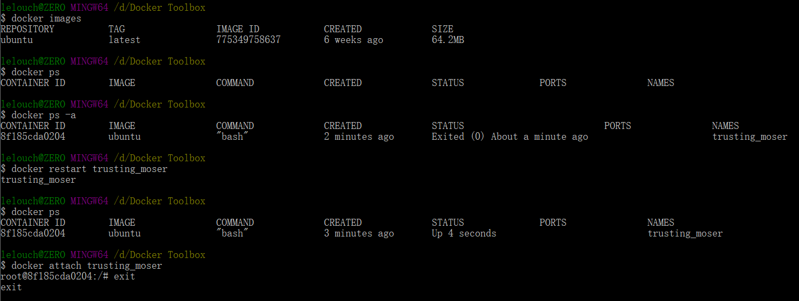

# docker操作使用

## docker安装

如果是window10s 专业版或者Max系统可以直接到官网下载docker desktop使用

我的电脑是windows 10家庭版,不能用docker desktop直接安装,需要使用docker toolbox.

下载时如果已安装git和virtualbox可以不用勾选,安装后桌面上会出现



选择Quickstart Terminal,启动时如果提示找不到就点击浏览到git安装目录下选择bash.exe

启动时会检查环境



如果卡在下载镜像就将toolbox安装目录下的boot2docker.iso镜像文件拷贝到对应的c盘目录`C:\Users\用户名\ .docker\machine\cache`

然后离线启动terminal,在出现waiting for an IP时重新连接网络即可成功配置环境

配置成功后会出现



如果打开virtualbox会看到



## docker使用

`docker version`查看版本信息,检查安装



可以使用docker --help查看命令帮助信息

### 运行第一个容器hello-world

`docker run hello-world`

第一次启动时会从网上下载到本地



运行镜像

`docker run -it ubuntu bash`

要点：-it 参数，通过终端与进程（容器）交互，stdin，stdout，stderr定向到TTY

出现错误



配置阿里云镜像加速下载

删除default docker-machine再重新创建

```
docker-machine rm default
```

```
docker-machine create --engine-registry-mirror=https://tnxkcso1.mirror.aliyuncs.com -d virtualbox default
```

之后再运行命令即可



可以在docker命令行运行ubuntu的终端了!

### docker基本操作

掌握查看docker的镜像和容器命令

`docker images`查看本地镜像库内容

`docker ps`查看运行中容器

`docker ps -a`显示所有容器(包含已中止)

继续运行容器并进入,输入容器的NAMES对容器进行操作

`docker restart trusting_moser`

`docker attach trusting_moser`

可以看到运行中容器增加了刚才运行过的ubuntu,使用attach就可以进入ubunt 终端

